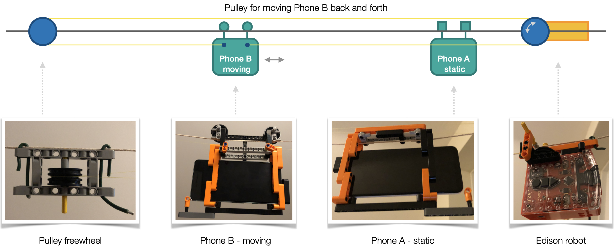

# Calibration data : RSSI to distance 

Bluetooth low energy (BLE) received signal strength indicator (RSSI) offer an estimator of physical proximity, where RSSI values decrease with increasing physical distance. The accurate conversion from RSSI to distance is an active area of research, as the process requires data modelling and calibration (Lovett et al., 2020), and radio signal is subject to interference (Leith and Farrell, 2020).

Reference data for RSSI values taken at different physical distances using different devices is fundamental for research. The manual production of this data is prohibitively time consuming and labour intensive. The aim of this work is to automate the process to make this data freely available to support research, using simple and widely available components to facilitate community participation and replication.

## Test environment

The automated process uses two phones running the HERALD demonstration app. The phones are set to capture RSSI continuously in the background, like a real app. The inertia sensor is enabled in HERALD to log significant movements  (i.e. when the phone is moved to a new position) to provide timestamps for separating RSSI measurements captured at different distances. One of the phones remain static, while the other is moved by a fixed distance at regular intervals to generate the reference data set. Manual post-processing is then applied to partition the data into time periods at different distances, using the inertia sensor data for guidance.

The test environment uses a cable cart and pulley system driven by an [Edison robot](https://meetedison.com) to move the phone by a fixed distance every 30 minutes to cover the measurement range, and then rewinding the phone back to its starting position ready for the next test. This simple setup is easy to replicate at minimal cost. The EdPy code for this automated process is available [here](edison.py).

## Reference data

| Date       | Phone A                          | Phone B                          | Range (cm) | Resolution (cm) | Duration (minutes) | Download                                      |
| ---------- | -------------------------------- | -------------------------------- | ---------- | --------------- | ------------------ | --------------------------------------------- |
| 2020-01-01 | iPhone 6S (iOS 12.1.4)      | Google Pixel 2 (Android 29) | 0 - 200    | 20              | 30                 | [B](20210101-1938-B.csv)                      |
| 2020-01-02 | iPhone 6S (iOS 12.1.4)      | Google Pixel 2 (Android 29) | 0 - 200    | 20              | 30                 | [B](20210102-1128-B.csv)                      |
| 2020-01-02 | iPhone 6S (iOS 12.1.4)      | Google Pixel 2 (Android 29) | 0 - 200    | 20              | 30                 | [B](20210102-1800-B.csv)                      |
| 2020-01-03 | Samsung J6 (Android 28)     | Samsung A20 (Android 29)    | 0 - 200    | 20              | 30                 | [A](20210103-1026-A) [B](20210103-1026-B.csv) |
| 2020-01-04 | Google Pixel 2 (Android 29) | Samsung A20 (Android 29)    | 0 - 300    | 25              | 30                 | [A](20210104-1422-A) [B](20210104-1422-B.csv) |
|            |                                  |                                  |            |                 |                    |                                               |

## References

Douglas J. Leith and Stephen Farrell (2020) "Measurement-Based Evaluation Of Google/Apple Exposure Notification API For Proximity Detection in a Commuter Bus". [arXiv:2006.08543](https://arxiv.org/abs/2006.08543)

Tom Lovett, Mark Briers, Marcos Charalambides, Radka Jersakova, James Lomax and Chris Holme (2020) "Inferring proximity from Bluetooth Low Energy RSSI with Unscented Kalman Smoothers". [arXiv:2007.05057](https://arxiv.org/abs/2007.05057)